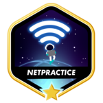
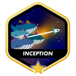

    

# Hi ! I'm Louis !

## About Me
- Student at 42 School in Computer Science.
- Passionate about endurance sports (running, swimming, cycling).
- Currently preparing for an Ironman (June 2025).

## Skills
Here are some of the technologies and languages I regularly use:

  

## 42 Lausanne | Common Core Curriculum

Here is the list of my completed or ongoing projects as part of my curriculum at 42 Lausanne.

| **Rank** | **Project**                                         | **Description**                                                                 |
|----------|----------------------------------------------------|---------------------------------------------------------------------------------|
| **Rank 0 - 1** ✅ |    | My personal library of standard C functions (includes `ft_printf` and `get_next_line`). |
| **Rank 2** ✅   |   | Sorting algorithm using two stacks and the Radix method.                   |
|          |   | A small game using the mlx graphical library.                     |
|          |     |  Program emulating a pipeline "|" between two commands.                      |
| **Rank 3** ✅   |  |  Implementation of the philosopher problem using threads and mutexes.                      |
|          |     | Recreation of a simple shell in C handling pipes, redirections, and other features.          |
| **Rank 4** ✅   |       | A clone of Wolfenstein 3D.                                                          |
|          |  | This project involves solving problems related to setting up a small functional network.          |
|          |  | Exercises from the C++ piscine, part one.                                    |
| **Rank 5** ✅   |  | Exercises from the C++ piscine, part two.                                 
|          |  | This project virtualizes multiple Docker images by creating them in a new virtual machine.      |
|          |    | Creation of an HTTP server from scratch.                                        |
| **Rank 6** ✅   |  | Creation of a web application in SPA format allowing to play PONG against an AI, in local multiplayer or on multiple web clients (and many other features). |

## Contact
Feel free to contact me via email or LinkedIn by clicking on the icons below:

